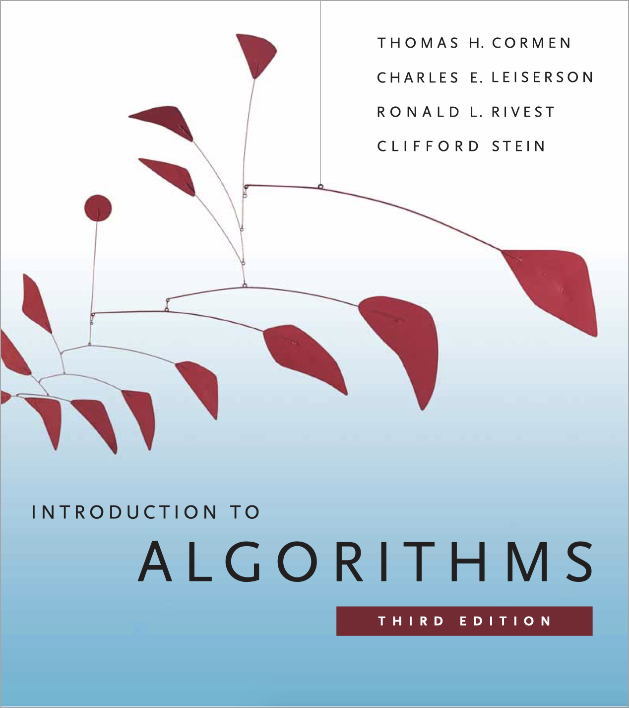

.. docs documentation master file, created by
   sphinx-quickstart on Sun Jan 23 19:45:54 2022.
   You can adapt this file completely to your liking, but it should at least
   contain the root `toctree` directive.

Algorithms
==================
.. toctree::
   :maxdepth: 3
   :caption: Contents:

Courses
-------------

Introduction to Algorithms (6.006)
+++++++++++++++++++++++++++++++++++

An introductory course covering elementary data structures ( **dynamic arrays, heaps, balanced binary search trees, hash tables** ) and algorithmic approaches to solve classical problems ( 
**sorting, graph searching, dynamic programming** ). 
Introduction to mathematical modeling of computational problems, as well as common algorithms, algorithmic paradigms, and data structures used to solve these problems. 
Emphasizes the relationship between algorithms and programming, and introduces basic performance measures and analysis techniques for these problems.

* `homepage <https://ocw.mit.edu/courses/electrical-engineering-and-computer-science/6-006-introduction-to-algorithms-spring-2020/>`_
* `solutions <https://github.com/DCtheTall/mit6.006>`_
* reference: `Introduction to Algorithms <../../../source/core/algor/Introduction\ to\ Algorithms_3rd.pdf>`_

  - solutions:

    `<https://walkccc.me/CLRS/>`_

    | `<https://github.com/gzc/CLRS>`_

Design and Analysis of Algorithms (6.046)
++++++++++++++++++++++++++++++++++++++++++++++++++

This course assumes that you have taken *6.006*. It introduces students to **the design of computer algorithms**, as well as **analysis of sophisticated algorithms**.

* `homepage <https://ocw.mit.edu/courses/electrical-engineering-and-computer-science/6-046j-design-and-analysis-of-algorithms-spring-2015/>`_
* `solutions <https://github.com/DCtheTall/mit6.046>`_
* reference: `Introduction to Algorithms`_, same as *Introduction to Algorithms*

Other references
---------------------

Algorithms(4th)
++++++++++++++++++

* `pdf <../../../source/core/algor/Algorithms_4th.pdf>`_
* `solutions <https://github.com/kevin-wayne/algs4>`_

.. image:: ../../../source/core/algor/Algorithms_cover.png
   :scale: 30 %

Data Structures and Algorithm Analysis in C
++++++++++++++++++++++++++++++++++++++++++++++

* `pdf <../../../source/core/algor/Data\ Structures\ and\ Algorithm\ Analysis\ in\ C.pdf>`_
